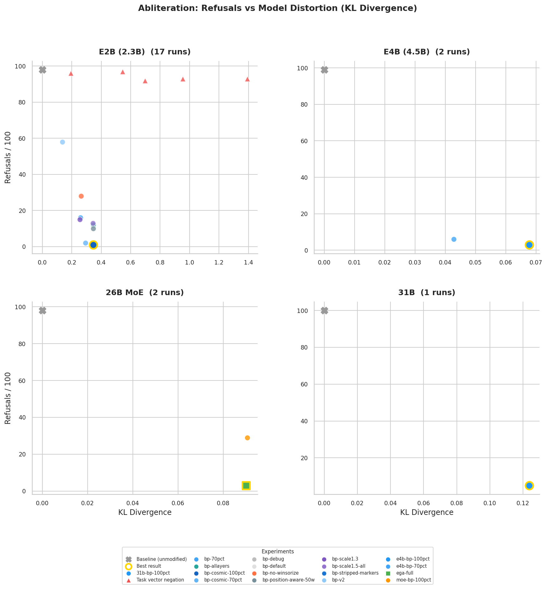

# Gemma 4 Abliteration

Abliterated (uncensored) versions of Google's Gemma 4 model family using norm-preserving biprojected abliteration and Expert-Granular Abliteration (EGA) for MoE models.

## Models

| Model | Params | Refusals | KL Div | HF (bf16) | HF (GGUF) |
|-------|--------|----------|--------|-----------|-----------|
| E2B | 2.3B dense | 3/686 (0.4%) | 0.346 | [TrevorJS/gemma-4-E2B-it-uncensored](https://huggingface.co/TrevorJS/gemma-4-E2B-it-uncensored) | [GGUF](https://huggingface.co/TrevorJS/gemma-4-E2B-it-uncensored-GGUF) |
| E4B | 4.5B dense | 5/686 (0.7%) | 0.068 | [TrevorJS/gemma-4-E4B-it-uncensored](https://huggingface.co/TrevorJS/gemma-4-E4B-it-uncensored) | [GGUF](https://huggingface.co/TrevorJS/gemma-4-E4B-it-uncensored-GGUF) |
| 26B-A4B | 25.2B MoE (3.8B active) | 5/686 (0.7%) | 0.090 | [TrevorJS/gemma-4-26B-A4B-it-uncensored](https://huggingface.co/TrevorJS/gemma-4-26B-A4B-it-uncensored) | [GGUF](https://huggingface.co/TrevorJS/gemma-4-26B-A4B-it-uncensored-GGUF) |
| 31B | 31B dense | 22/686 (3.2%) | 0.124 | [TrevorJS/gemma-4-31B-it-uncensored](https://huggingface.co/TrevorJS/gemma-4-31B-it-uncensored) | [GGUF](https://huggingface.co/TrevorJS/gemma-4-31B-it-uncensored-GGUF) |

Refusal rates measured across 686 prompts from 4 independent datasets (JailbreakBench, tulu-harmbench, NousResearch, mlabonne). Every flagged refusal was manually audited — most are refusal-then-comply false positives.



## Method

**Dense models (E2B, E4B, 31B):** Norm-preserving biprojected abliteration. Per-layer refusal directions are computed from 800 harmful/harmless prompt residuals, orthogonalized against harmless means, and projected out of `o_proj` + `mlp.down_proj` weights while preserving row norms.

**MoE model (26B-A4B):** Same as above on the dense pathway, plus Expert-Granular Abliteration (EGA) — hooks MoE routers to compute per-expert routing weights, then applies the same projection to each of the 128 expert `down_proj` slices per layer. Dense-only abliteration leaves 29/100 refusals; adding EGA drops it to 3/100.

Built on [heretic](https://github.com/p-e-w/heretic). EGA concept from [OBLITERATUS](https://github.com/elder-plinius/OBLITERATUS). Biprojection from [grimjim](https://huggingface.co/blog/grimjim/abliteration-biprojection).

## Quick Start

```bash
# Install heretic
uv tool install 'heretic-llm @ git+https://github.com/p-e-w/heretic' --with protobuf

# Abliterate a dense model
HF_DATASETS_CACHE=/tmp/hf_datasets_cache \
  heretic-python scripts/abliterate.py biprojection \
  --model google/gemma-4-E4B-it \
  --top-pct 100 --strip-topic-markers --skip-prefix --batch-size 4 \
  --auto-save models/output-dir

# Abliterate the MoE model (EGA)
HF_DATASETS_CACHE=/tmp/hf_datasets_cache \
  heretic-python scripts/ega.py \
  --model google/gemma-4-26B-A4B-it \
  --strip-topic-markers --skip-prefix --no-eval --batch-size 4 \
  --save models/output-dir

# Memory-efficient 31B (4-bit directions + bf16 shard-by-shard save)
heretic-python scripts/export_31b.py
```

## Scripts

| Script | Purpose |
|--------|---------|
| `abliterate.py` | Experiment driver — Optuna search and biprojection modes |
| `ega.py` | Expert-Granular Abliteration for MoE models |
| `export.py` | Save weights, convert GGUF, push to HF |
| `export_31b.py` | Memory-efficient 31B export (4-bit directions + bf16 shards) |
| `multi_eval.py` | Cross-dataset validation (686 prompts, 4 datasets) |
| `dashboard.py` | Scatter plot + bar chart of all experiment results |
| `sanity_check.py` | Baseline vs abliterated quality comparison |
| `task_vector.py` | Task vector negation (tested, ruled out) |

## Key Findings

1. **Biprojection + EGA covers both dense and MoE** — sub-1% refusal rate across all models
2. **Larger models absorb abliteration better** — E4B KL=0.07 vs E2B KL=0.35
3. **MoE experts carry most refusal signal** — dense-only gets 29/100, EGA gets 3/100
4. **Default refusal markers are broken** — "illegal", "harmful" etc. match disclaimers, not refusals
5. **Task vector negation doesn't work** — sharp phase transition, no usable middle ground
6. **4-bit directions ≈ bf16 directions** — mean cosine similarity 0.935, fine for abliteration

## Repo Structure

```
├── ABLITERATION.md    # Full research doc with tables and references
├── STATE.md           # Current best results per model
├── IDEAS.md           # Prioritized technique backlog
├── REDTEAM.md         # Red team benchmark survey
├── scripts/           # All experiment and export scripts
├── experiments/       # JSON results from every experiment
├── prompts/           # Eval datasets (150 iteration + 686 full)
├── models/            # Saved weights (gitignored)
└── checkpoints/       # Heretic Optuna checkpoints (gitignored)
```

## License

Apache 2.0 (same as base Gemma 4 models).
